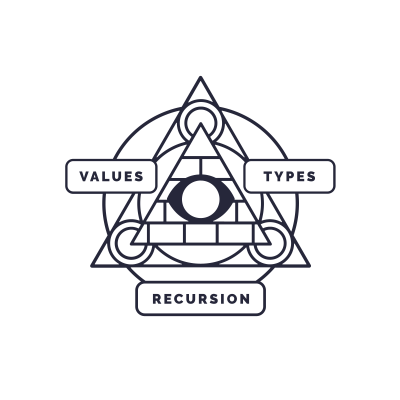

# Coursework for Haskell MOOC of University of Helsinki

This repository contains my answers to the exercises of the excellent functional programming with haskell -course at the University of Helsinki.

The course is online and open for anyone to complete, please see the link below if you are interested.

Please note that if you are currently doing the course just simply copying the answers here (or from someone elses repository) constitutes as cheating and does nothing for your learning, so I'd advise you to reconsider. If you find yourself stuck you should read the course material again or join the course Telegram channel (found on the course site) and ask away :)

## Haskell MOOC

University of Helsinki

[Course page](https://haskell.mooc.fi)

This work is licensed under a [Creative Commons Attribution-ShareAlike 4.0 International License](http://creativecommons.org/licenses/by-sa/4.0/).
